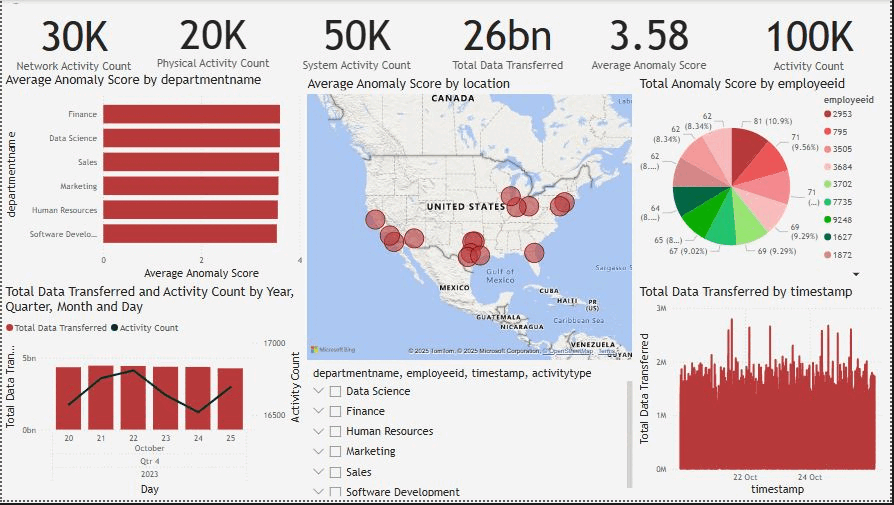

# Insider Threat Analysis

This project analyzes employee behavior data to detect potential insider threats using Power BI dashboards.

## 👁 Preview

## 📁 Files Included
- Power BI File: `Insider_Threat_Dashboard.pbix`
- SQL Files: `Anomaly_Update.sql`,'Create_Import.sql'
- Project Preview: `Project_Preview.gif

## 🛠 Tools Used
- Power BI
- Excel
- PostgreSQL
- Data Modeling (DAX)